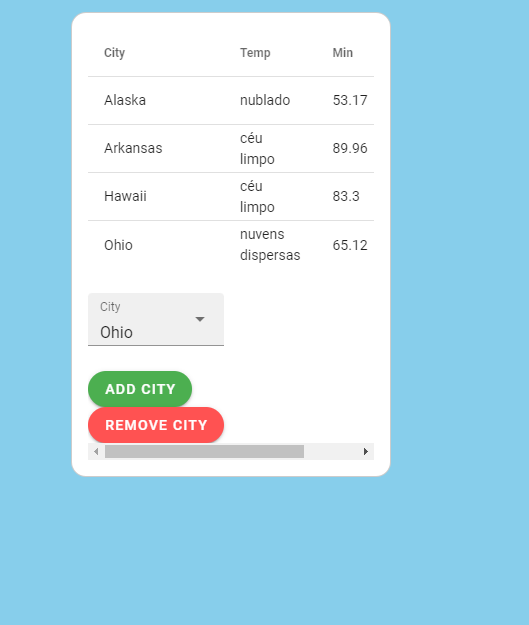

# API-Weather
Construindo o front-end usando API Weather

# tarefas

API Weather é uma aplicação onde você pode ver como está o tempo em todo o mundo.

# Recursos

* O aplicativo foi desenvolvido com JavaScrip, CSS, HTML, BootStrap, Vuetify, Vuex, Vue Router e Vue 2.

# Uso

1. Clone o repositório do GitHub.
2. Abra o projeto no seu editor de código.
3. Instale o pacote do projeto com npm install.
3. Starte o projeto com npm run serve.

# Créditos

Este projeto foi criado por Alaska Websites.